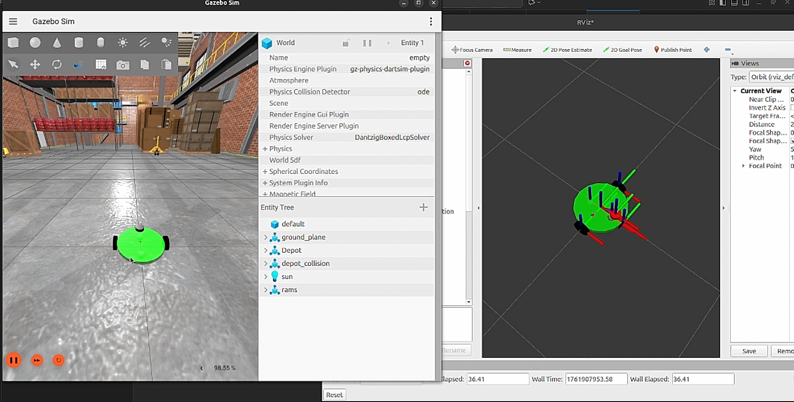
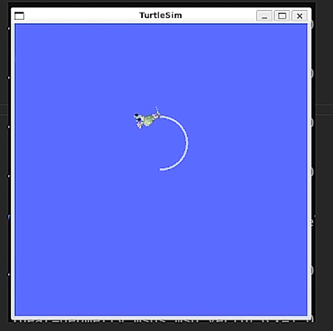

# ROS 2 Jazzy Robotics Course Workspace

Welcome to the complete source code workspace for the ROS 2 Jazzy Robotics Course. This repository contains a series of ROS 2 packages that guide you from the foundational concepts of ROS 2 to building, simulating, and controlling a robot.


**Robot in action**

---

## 📚 Course Materials

All the source materials for this course, including video lectures and supplementary files, can be found at the following link:

[**ROS 2 Jazzy Robotics Course Materials (Google Drive)**](https://drive.google.com/drive/folders/1cE_DpQ9QuqycPbFzI72kc3y2l2sRdwBO?usp=drive_link)

This GitHub repository contains the completed source code that is developed throughout the course videos.

---

## 📝 Project Overview

This workspace is a hands-on guide to building with ROS 2 Jazzy. It is structured into three distinct packages, each serving a specific purpose in the learning and development pipeline.

1.  **`pub_sub`:** The starting point. This package covers the fundamental building blocks of ROS 2, including Nodes, Topics, Services, and Launch files, all demonstrated with the classic TurtleSim.
2.  **`tutorial_interfaces`:** A dedicated package for learning how to define and build custom message (`.msg`) and service (`.srv`) types, a crucial skill for any real-world robotics project.
3.  **`rams`:** The main robot package. This is where everything comes together. It contains the robot's 3D model (URDF/Xacro), the Gazebo simulation world, sensor configurations, and the launch files needed to bring the robot to life in a simulated environment.

---

## ✨ Features

-   **Core ROS 2 Concepts:** Clear Python examples of publishers, subscribers, service clients, and service servers.
-   **Custom ROS 2 Interfaces:** A self-contained `ament_cmake` package demonstrating how to create, build, and use custom `.msg` and `.srv` files.
-   **Launch File Automation:** Centralized launch files to start multi-node systems like TurtleSim or a full Gazebo simulation with a single command.
-   **Advanced Robot Modeling:** A modular robot description built with **Xacro**, featuring properties for easy modification.
-   **Full Gazebo Harmonic Simulation:**
    -   A custom world file (`.sdf`) for the simulation environment.
    -   A robot model fully integrated with Gazebo plugins for differential drive, Lidar, camera, and IMU sensors.
    -   A pre-configured **`ros_gz_bridge`** to seamlessly translate data between Gazebo and ROS 2 for sensor visualization in RViz.

---

## 📦 Package Breakdown

### `pub_sub`
The foundational package for learning.
-   **Nodes:** Contains Python scripts for various nodes:
    -   `publisher.py`: Controls TurtleSim by publishing `Twist` messages.
    -   `subscriber.py`: Subscribes to TurtleSim's pose and prints it.
    -   `change_pos.py`: A service client to teleport the turtle.
    -   `pub_custom_msg.py`: Publishes our custom `RGB` message.
    -   `grayscale_server.py` & `grayscale_client.py`: A client/server pair using our custom `RGBToGrayscale` service.
-   **Launch:**
    -   `control.launch.py`: Starts TurtleSim and the publisher node together.
    

### `tutorial_interfaces`
The blueprint package for our custom data types.
-   **`msg/RGB.msg`**: A custom message to hold three `int64` values for Red, Green, and Blue.
-   **`srv/RGBToGrayscale.srv`**: A custom service that takes an `RGB` message as a request and returns a `float32` grayscale value as a response.

### `rams`
The primary robot simulation package.
-   **`urdf/`**: Contains the robot's model, written in modular `.xacro` files.
-   **`launch/`**:
    -   `rsp.launch.py`: Launches the Robot State Publisher and RViz2, configured for simulation time.
    -   `gazebo.launch.py`: Launches the Gazebo simulator, spawns the robot, and starts the ROS-Gazebo bridge.
-   **`world/`**: Contains the `world.sdf` file defining the simulation environment.
-   **`config/`**: Contains `ros_gz_bridge.yaml`, which maps Gazebo topics (like Lidar and camera data) to ROS 2 topics.

---

**Hardware Integration**

## 📋 Prerequisites

Before you begin, ensure you have the following installed on your system:

-   **Ubuntu 24.04** (or Ubuntu 24.04 running via WSL on Windows)
-   **ROS 2 Jazzy Jalisco:** [Official Installation Guide](https://docs.ros.org/en/jazzy/Installation.html)
-   **Gazebo Harmonic:** [Official Installation Guide](https://gazebosim.org/docs/harmonic/install_ubuntu)
-   **Colcon:** The standard ROS 2 build tool (`sudo apt install python3-colcon-common-extensions`)
-   **Xacro:** The robot modeling tool (`sudo apt install ros-jazzy-xacro`)
-   **ROS 2 Gazebo Integration Tools:** (`sudo apt install ros-jazzy-ros-gz`)

---

## 🚀 Installation & Setup

1.  **Clone the Repository:**
    Open a terminal and clone this repository. The directory is already named `jazzy_ws`, so you can clone it as is.
    ```bash
    git clone https://github.com/yashu-7/ROS-Course.git
    cd jazzy_ws
    ```

2.  **Install Dependencies:**
    Use `rosdep` to automatically install any missing package dependencies from the `src` directory.
    ```bash
    rosdep install -i --from-path src --rosdistro jazzy -y
    ```

3.  **Build the Workspace:**
    Run `colcon build` from the root of the workspace to compile all packages.
    ```bash
    colcon build
    ```

4.  **Source the Workspace:**
    To make the executables and launch files available in your terminal, source the setup file. It is highly recommended to add this command to your `.bashrc` for convenience.
    ```bash
    echo "source $(pwd)/install/setup.bash" >> ~/.bashrc
    source ~/.bashrc
    ```

---

## 🕹️ How to Run

Open a new terminal for each command. Sourcing your `.bashrc` ensures each new terminal is aware of the workspace.

### Demo 1: Core Concepts with TurtleSim

This launch file starts the TurtleSim simulator and our custom publisher node, which will make the turtle move.
```bash
ros2 launch pub_sub control.launch.py
```

### Demo 2: Visualizing the Robot Model
This will launch robot_state_publisher and RViz to display the 3D model of the rams robot from its Xacro file. The robot will be static.
```bash
ros2 launch rams rsp.launch.py
```

### Demo 3: Full Gazebo Simulation

This is the main event. It requires starting two processes in separate terminals.

**Terminal 1: Launch RViz & Robot State Publisher**
This terminal is for visualization.
```bash
ros2 launch rams rsp.launch.py
```

**Terminal 2: Launch Gazebo Simulation**
This terminal runs the physics simulation and spawns the robot.
```bash
ros2 launch rams gazebo.launch.py
```
**Terminal 3 (Optional): Control with Keyboard**
You can now control the robot in Gazebo using your keyboard. The robot's movement and sensor data (like Lidar scans) will be visible in RViz.
```bash
ros2 run teleop_twist_keyboard teleop_twist_keyboard
```

📄 License
This project is licensed under the MIT License. See the LICENSE file for details.
